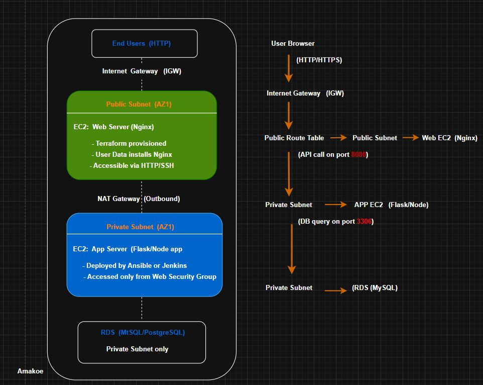
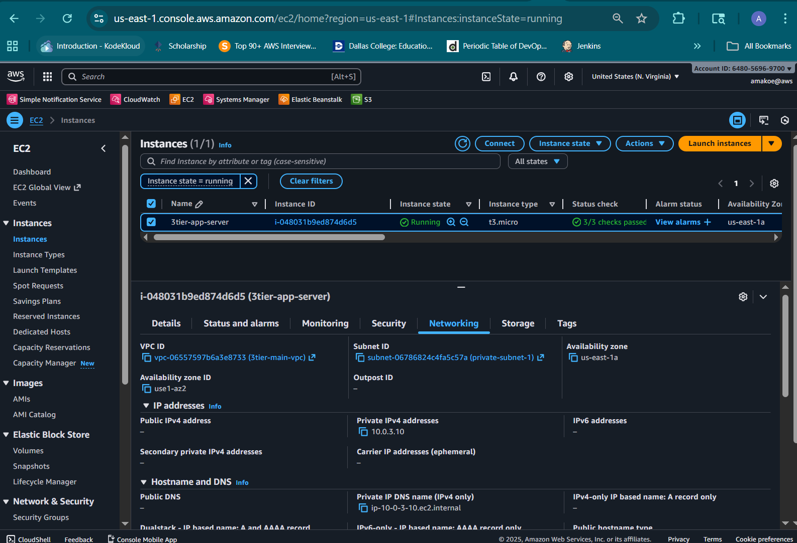
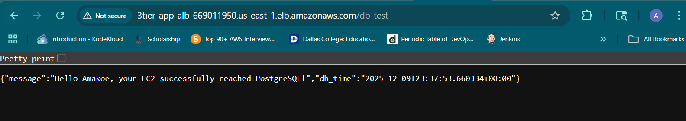
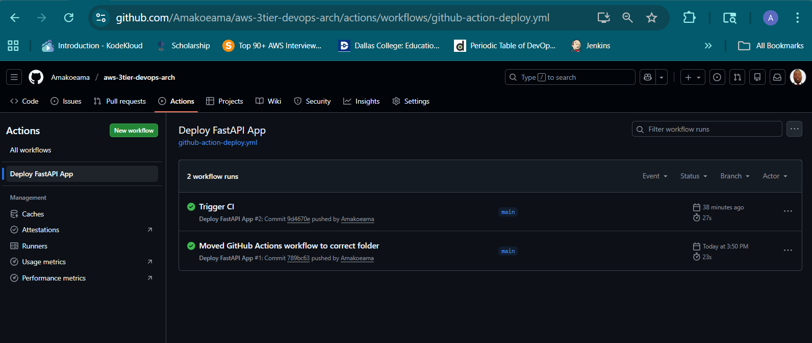
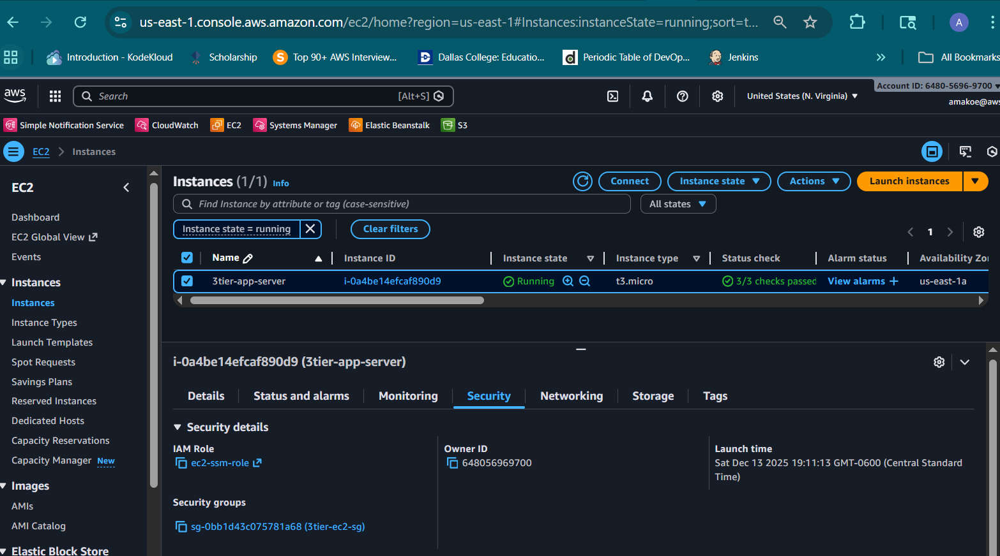
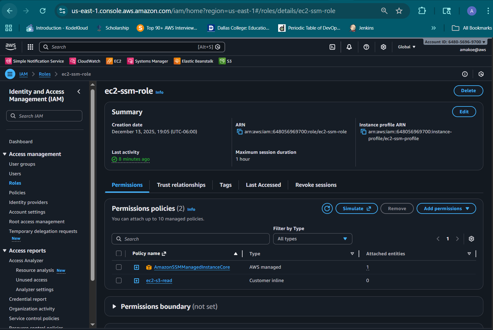
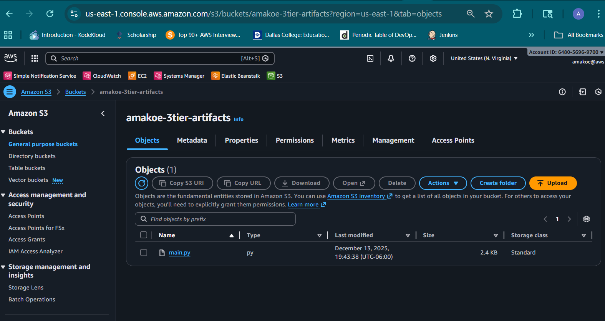

#--- Three-Tier AWS Architecture with Terraform and FastAPI ---

This repository implements a complete three-tier cloud architecture deployed on AWS using Terraform, FastAPI, PostgreSQL, and GitHub Actions. The project demonstrates infrastructure automation, private networking, secure IAM design, backend API development, and a functional CI/CD workflow that updates application code on a private EC2 instance without SSH access.

#--- Motivation ---

I developed this project to deepen my understanding of cloud architecture, secure system design, and end-to-end automation. My objective was to create a reproducible three-tier environment that applies industry practices such as infrastructure-as-code, private networking, least-privilege IAM, automated deployments, and service-level monitoring. The work reflects my ongoing preparation for advanced study and professional roles in cloud engineering, DevOps, and cybersecurity, and it serves as a technical foundation for future academic research in secure and scalable distributed systems.

#--- Project Overview ---

The system includes the following components:

- A custom VPC with public and private subnets across multiple availability zones.
- An Application Load Balancer that exposes the application to the internet.
- A private EC2 application server running FastAPI and SQLAlchemy.
- A PostgreSQL RDS instance deployed in isolated database subnets.
- IAM roles for EC2, SSM, and S3 access following least-privilege principles.
- A FastAPI application that interacts with PostgreSQL through SQLAlchemy.
- A CI/CD workflow using GitHub Actions for automated deployments.
- Terraform for full infrastructure provisioning and environment reproducibility.

#--- Architecture Diagrams ---

## High-Level AWS Architecture

## Conceptual Flow Diagram

#--- Infrastructure Design ---

## VPC and Subnet Layout
The VPC is deployed with public subnets for the Application Load Balancer and NAT gateways, and private subnets for the EC2 application server and RDS database. This separation ensures controlled exposure and defense-in-depth.

## Routing and NAT Gateways
Instances within private subnets forward outbound traffic through NAT gateways, allowing internet access (e.g., package installation) without exposing workloads to inbound connections.

## Application Load Balancer
The ALB receives all incoming HTTP requests on port 80 and forwards them to EC2 instances via a target group. This enables horizontal scalability and provides health check mechanisms.

## EC2 Instance Architecture
The EC2 instance operates without a public IP address. Administration occurs through AWS Systems Manager Session Manager, removing the need for SSH access or key pairs.

#--- Application Layer ---

The backend is built using FastAPI and SQLAlchemy. During initialization, the application:

- Loads database connection parameters from environment variables written onto the instance at bootstrap.
- Establishes a connection to the PostgreSQL instance.
- Creates required tables via SQLAlchemy metadata.
- Provides endpoints for inserting and retrieving messages stored in the database.

A successful database connectivity test is shown below:

#--- CI/CD Workflow ---

A GitHub Actions workflow automates the deployment of updated application code to the EC2 instance.

The workflow performs the following steps:

1. Packages the updated FastAPI source file.
2. Uploads it to an S3 bucket for artifact storage.
3. Initiates an SSM Run Command targeting EC2.
4. The EC2 instance downloads the artifact from S3.
5. The FastAPI service is restarted to apply the update.

This approach removes the need for SSH and creates a secure, automated deployment workflow.

#--- IAM and Security Controls ---

## EC2 Role for SSM Access
The EC2 instance assumes an IAM role that enables interaction with AWS Systems Manager. This allows the instance to register with SSM for remote administration without exposing SSH ports.

## EC2 Inline Policy for S3 Artifact Retrieval
An additional inline policy is attached to the EC2 role to permit minimal S3 actions. This allows the instance to pull deployment artifacts securely.

#--- Deployment and Automation ---

## S3 Artifact Storage
Application updates are uploaded to an S3 bucket and used as a source during deployments.

## Update Script on EC2
The EC2 instance includes a script located under `/opt/deploy/update_app.sh` that:

- Downloads the latest application file from S3.
- Replaces the running version.
- Restarts the FastAPI systemd service.

This allows the instance to update itself in a controlled and repeatable way.

#--- Load Balancing and Networking ---

Incoming requests follow this path:

User → Application Load Balancer → Private EC2 instance → RDS PostgreSQL database

This layered approach preserves security by ensuring no database or compute resources are exposed directly to the public internet.

Traffic is only permitted through controlled security group rules and managed AWS endpoints.

#--- Repository Structure ---

aws-3tier-devops-arch/
├── app/
│ ├── main.py
│ └── requirements.txt
├── diagram/
│ └── screenshots/
│ ├── 01_aws_3tier_architecture.png
│ ├── 02_conceptual_flow.png
│ ├── 03_ec2_rds_connection_test.png
│ ├── 04_alb_overview.png
│ ├── 05_ec2_private_subnet.png
│ ├── 06_ec2_ssm_role.png
│ ├── 07_ec2_s3_permissions.png
│ ├── 08_github_actions_pipeline.png
│ └── 09_s3_artifacts_bucket.png
├── scripts/
│ └── ec2-bootstrap.sh
├── terraform/
│ ├── ec2.tf
│ ├── loadbalancer.tf
│ ├── main.tf
│ ├── outputs.tf
│ ├── provider.tf
│ ├── rds.tf
│ ├── security.tf
│ ├── variables.tf
│ └── vpc.tf
└── README.md

#--- How to Reproduce ---

## Prerequisites
- Terraform installed on the local environment
- AWS CLI configured with appropriate credentials
- S3 bucket created for deployment artifacts
- GitHub repository configured with required secrets for CI/CD
- IAM user for GitHub Actions with limited permissions for S3 and SSM

## Deployment Steps

1. Clone the repository.

git clone https://github.com/Amakoeama/aws-3tier-devops-arch.git

2. Change into the Terraform directory:

cd terraform

3. Initialize Terraform:

terraform init

4. Preview the infrastructure:

terraform plan

5. Deploy the infrastructure:

terraform apply

6. Retrieve the ALB DNS endpoint from Terraform outputs.
7. Test the application by performing GET and POST requests through the ALB.
8. Commit any application updates and push to GitHub to trigger the CI/CD process.

#--- Future Improvements ---

The following enhancements could further extend the project:

- Containerizing the application with Docker for portable deployments.
- Migrating the application layer to ECS, EKS, or Lambda for improved scalability.
- Adding an Auto Scaling Group behind the load balancer.
- Integrating CloudWatch metrics, alarms, and structured logging.
- Introducing distributed tracing for request-level visibility.
- Implementing AWS Secrets Manager or Parameter Store for secure credential handling.
- Adding Terraform modules to improve reusability and maintainability.
- Deploying a Web Application Firewall (WAF) for additional request filtering.
- Building automated integration tests to validate infrastructure changes.

#--- Author ---

This project was implemented by Amakoe Ama-gbodonon as part of continued development in cloud infrastructure, secure system architecture, and DevOps automation.

